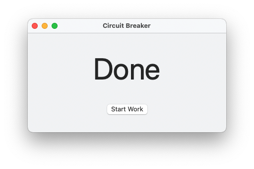

+++
title = "Circuit Breaker"
type = "page"
layout = "static"
date = 2021-12-26
summary = "A no-nonsense Pomodoro app that enables Focus mode to keep you in the zone."
+++

A no-nonsense Pomodoro app that enables Focus mode to keep you in the zone. It turns Focus mode on when in work mode, and turns it off in break mode, to prevent you from compulsively checking your notifications in fear you might have missed something.

I think macOS apps are supposed to have a fancy landing page, but this is all I've got, so use your imagination.

Here's a picture.

Download it [here](<Circuit Breaker 1.0.dmg>). Compatible with macOS 12.1+, Intel & Apple Silicon.
